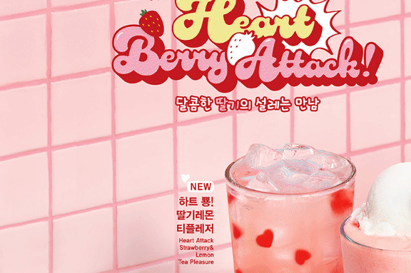
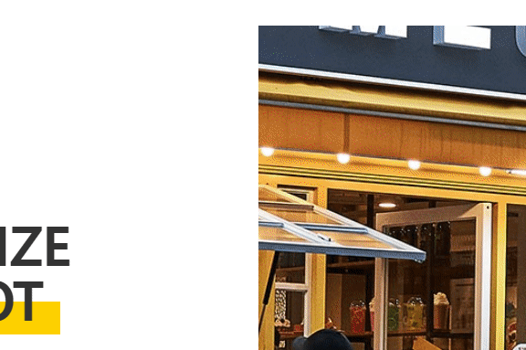

# megacoffe-vanilla-clone-coding

배포 by netlify <br />
<a href="https://whimsical-rugelach-f688e2.netlify.app" title="이동!"> 클론코딩 사이트</a>

<a href="https://www.mega-mgccoffee.com/#main" title="이동!"> 메가커피 원본 사이트</a>

# ☕ MEGACOFFEE 


<br/>

## 📜 스크롤 화면 이동

> 뷰포트 화면 이동은 window객체의 wheel을 막고 , 화면을 section으로 나누어 gsap의 #id로 이동하는 것으로 구현.

```javascript
// wheel 막는것
window.addEventListener("wheel", function(e){
	e.preventDefault();
},{passive : false});

const sectionEls = document.querySelectorAll(".section")

const arrIds = [];

sectionEls.forEach(function(titleTextEl, index) {
  arrIds.push(titleTextEl.getAttribute('id'))
})

let lastScrollTop  = 0
let numIndex = 0;

function scrolling(event) {
  // 화면 이동
  if(event.deltaY > 0) {
    if(numIndex + 1 < arrIds.length) {
      numIndex += 1
    }
  } else {
    if(numIndex - 1 >= 0) {
      numIndex -= 1
  }
  
  gsap.to(window, { duration: .6, scrollTo: '#'+arrIds[numIndex] });
}
```
## 💻 화면에 보여졌을때 요소 출력






> ScrollMagic 라이브러리를 이용하여 구현하였다.

```javascript
const companyLeftEls = document.querySelectorAll('.company__wrapper__left')
companyLeftEls.forEach(function (leftEl) {
  new ScrollMagic
    .Scene({
      triggerElement: leftEl,
      triggerHook: 0.2
    })
    .setClassToggle(leftEl, 'show')
    .addTo(new ScrollMagic.Controller()) 
})
```

```css
/* 평소엔 보이지 않다가 .show 클래스가 추가되면 보이는 형태 */
.back-to-position-bg {
  transition: .5s;
}
.show .back-to-position-bg {
  width: 110%;
}
.show .back-to-position-bg-company {
  width: 63%;
}
.back-to-position.to-right {
  transform: translateX(-50px);  
}
.back-to-position.to-left {
  transform: translateX(50px);
}
.back-to-position.to-up {
  transform: translateY(50px);
}
.back-to-position.to-down {
  transform: translateY(-50px);
}
.show .back-to-position {
  opacity: 1;
  transform: translateX(0);
}
/* delay */
.show .back-to-position.delay-0 {
  transition-delay: 0s;
}
.show .back-to-position.delay-1 {
  transition-delay: .3s;
}
.show .back-to-position.delay-2 {
  transition-delay: .6s;
}
.show .back-to-position.delay-3 {
  transition-delay: .9s;
}
.show .back-to-position.delay-4 {
  transition-delay: 1.2s;
}
```


## 👓 스크롤바 숨기기


```css
/* 스크롤바 숨기기 */
::-webkit-scrollbar {
  display: none; /* 모든 스크롤바 숨기기 */
}
```

<br />

## 📹 Youtube API

> youtube iframe 문서를 참조하였다. https://developers.google.com/youtube/iframe_api_reference?hl=ko

> 유튜브 영상은 16 : 9 의 width와 height를 지정해줘야한다.
```css
#player {
  width: 515px;
  height: calc(515px * 9 / 16);
  border: none;
}
```

```javascript
var tag = document.createElement('script');

tag.src = "https://www.youtube.com/iframe_api";
var firstScriptTag = document.getElementsByTagName('script')[0];
firstScriptTag.parentNode.insertBefore(tag, firstScriptTag);

function onYouTubeIframeAPIReady() {
  new YT.Player('player', {
    videoId: 'Ppe5NIRco8A',
    playerVars: {
      autoplay: true,
      loop: true,
      playlist: 'Ppe5NIRco8A',
      controls: 0
    },
    events: {
      onReady: function(event) {
        event.target.mute();
      }
    }
  });
}
```


